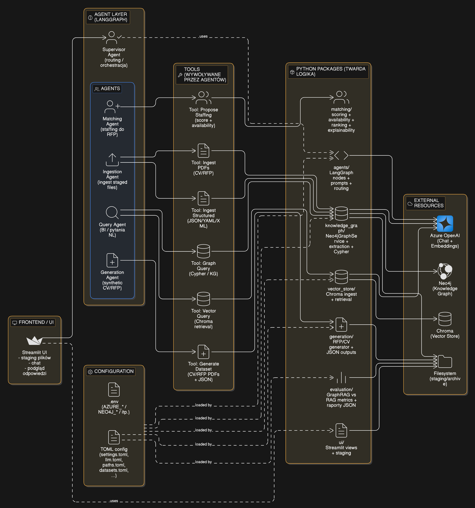
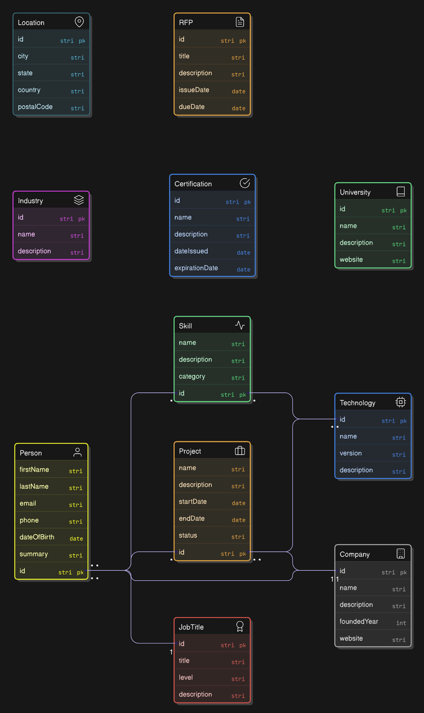

# Talent Match AI — Dokumentacja końcowa projektu

> **Wersja:** v1.0  
> **Data:** 2026-01-30  
> **Autorzy:** Jan Dąbrowski, Krzysztof Dudek  
> **Repozytorium:** https://github.com/itischrisd/talentmatch-ai

---

## 1. Wprowadzenie

### 1.1 Problem biznesowy
W organizacjach realizujących projekty (software house, body leasing, consulting) wiedza potrzebna do odpowiedzi na RFP i zbudowania zespołu jest rozproszona: CV, opisy projektów, certyfikaty, notatki, przypisania i dostępność. W praktyce oznacza to ręczne przeszukiwanie dokumentów i “sklejanie” argumentów do oferty oraz ryzyko, że dostępność lub luki kompetencyjne zostaną wykryte zbyt późno.

Kluczowa obserwacja: to nie brak danych jest problemem, tylko brak szybkiego, praktycznego dostępu do wiedzy w formie “gotowej do użycia” (odpowiedź + uzasadnienie + fragmenty dowodowe).

### 1.2 Wizja systemu TalentMatch AI
TalentMatch AI to asystent dla Sales Leada i Staffing Managera, który pomaga szybciej odpowiadać na RFP, budować narrację oferty i proponować zespół wraz z uzasadnieniem. System nie jest “nieomylnym źródłem prawdy” – jest narzędziem wspierającym zadania, w których liczy się szybkość i użyteczność, a nie 100% precyzja i kompletność.

System zwraca wynik w formacie gotowym do użycia w pracy:
- **Answer** – konkretna odpowiedź,
- **Reasoning** – dlaczego tak,
- **Evidence** – cytowalne fragmenty z dokumentów,
- **Limitations** – gdzie dane są niepewne / czego nie da się stwierdzić.

### 1.3 Dla kogo (użytkownicy docelowi)
**Sales Lead**
- przygotowuje ofertę / pitch / odpowiedź na RFP,
- potrzebuje szybkiej propozycji zespołu + argumentów do slajdów,
- liczy się czas, spójność narracji i wiarygodne “evidence”.

**Staffing Manager**
- buduje realny zespół i pilnuje dostępności,
- potrzebuje filtrowania po skills/seniority i scenariuszy “what-if”,
- liczy się kontrola luk, kompromisy i transparentność doboru.

### 1.4 Zakres: co system robi, a czego nie robi
**System robi ✅**
- indeksuje dokumenty: CV, RFP, opisy projektów,
- odpowiada na pytania analityczno-biznesowe (filtrowanie, agregacje w obrębie kontekstu),
- proponuje staffing do RFP w trybie **best-effort** oraz wskazuje luki,
- zwraca odpowiedzi w formacie: Answer + Reasoning + Evidence + Limitations.

**System nie robi ⛔**
- nie jest jedyną bazą prawdy dla HR/delivery,
- nie gwarantuje 100% kompletności,
- nie podejmuje decyzji za człowieka (dostarcza rekomendacje i argumenty),
- nie jest modułem kosztowym/HR.

### 1.5 Główne scenariusze użycia (wysoki poziom)
**Use case #1: dopasowanie kandydatów do RFP**
- input: ID RFP lub opis potrzeb (role, skills, seniority, termin),
- system stara się spełnić wymagania z minimalnym “overkill”,
- jeśli nie da się spełnić 100% wymagań → “next best” + jawne braki,
- wynik: proponowany zespół, coverage, gaps, kompromisy, uzasadnienie i dowody.

**Use case #2: zapytania analityczno-biznesowe w języku naturalnym**
- szybkie przybliżenie na bazie kontekstu CV (np. liczenie, agregacje, ranking),
- wynik: odpowiedź + reasoning + evidence (cytowalne fragmenty).

### 1.6 Zastosowane technologie

#### Język, runtime i packaging
- **Python >= 3.13**
- **setuptools + wheel** (build system)

#### LLM i integracja z Azure OpenAI
- **Azure OpenAI (Chat + Embeddings)**:
  - endpoint, api_key, api_version, deploymenty chat i embeddings ładowane z `.env` i scalane z konfiguracją TOML 
- **langchain-openai** (integracja z Azure OpenAI)

#### Orkiestracja agentów / logika “assistant-first”
- **langgraph** (graf agentów / przepływ sterowania)
- **langgraph-supervisor** (supervisor / routing między agentami)
- **langchain-experimental**

#### Knowledge Graph / GraphRAG
- **Neo4j** (baza grafowa)
- **langchain-neo4j** (warstwa integracji z Neo4j / GraphRAG) 

#### Klasyczny RAG (Vector Store)
- **Chroma** poprzez **langchain-chroma** (vector store do retrieval) 
- **Text splitting** (chunking) i retrieval po embeddingach (konfigurowalne parametry chunk_size, overlap, top_k)

#### Przetwarzanie dokumentów i generowanie danych
- **unstructured[pdf]** (przetwarzanie PDF w ingestion)
- **reportlab** (generowanie PDF dla CV/RFP w generatorze datasetu) 
- **faker** (generowanie syntetycznych profili, projektów i RFP) 

#### Frontend
- **Streamlit** (UI: staging plików + chat)

#### Konfiguracja i zarządzanie ustawieniami
- **TOML** jako format konfiguracji (np. ścieżki i polityki datasetu) 
- **pydantic + pydantic-settings** (modele konfiguracji, walidacja, zasilanie z `.env`) 
- Przełączanie backendu storage (**neo4j** vs **vector_store**) w ustawieniach 

#### Docker (uruchomienie środowiska)
- **Docker** (np. dla Neo4j / Chroma).

---

## 2. Opis architektury systemu

### 2.1 Diagram architektury



### 2.2 Źródła danych
- **CV (PDF)** — wgrywane w UI do katalogu staging i następnie ingestowane do wybranego backendu (KG lub VectorDB).
- **RFP (PDF / tekst)** — analogicznie jak CV: staging → ingest → możliwość zapytań i dopasowań.
- **Dane ustrukturyzowane (JSON/YAML/XML)** — np. alokacje / przypisania do projektów; wspierane w ingestii zarówno dla KG, jak i VectorDB.

> System wspiera dwa tryby przechowywania/wyszukiwania:
> - **Knowledge Graph (Neo4j)** — tryb GraphRAG / zapytania Cypher + logika dopasowań po strukturze grafu.
> - **Vector Store (Chroma)** — tryb tradycyjnego RAG jako baseline (similarity search + odpowiedź LLM na kontekście).

### 2.3 Moduły systemu

#### 2.3.1 Ingestion (CV/RFP/JSON → KG/VectorDB)
Ingestion uruchamiany jest poprzez **tool** na żądanie użytkownika w rozmowie (np. „Ingest staged files”), a pliki są wcześniej wgrywane przez panel boczny Streamlit do katalogów staging.

**Tryb Knowledge Graph (Neo4j):**
- PDF (CV/RFP) są przetwarzane przez komponent ekstrakcji grafowej (LLM → encje/relacje) w trybie „strict” (dozwolone typy węzłów/relacji i właściwości), a następnie zapisywane do Neo4j.
- Po udanym przetworzeniu pliki są archiwizowane do katalogu `archive_dir/ingested_<timestamp>/`.
- Dane ustrukturyzowane (JSON/YAML/XML) są ingestowane jako osobny krok i również trafiają do archiwum.

**Tryb VectorDB (Chroma):**
- PDF są ładowane, dzielone na chunki (text splitter z parametrami z konfiguracji) i zapisywane do Chroma z metadanymi (np. typ dokumentu i źródło).
- Dane ustrukturyzowane są ingestowane jako tekst (z normalizacją JSON) i również chunkowane.
- Po udanym przetworzeniu pliki są przenoszone do `archive_dir/vector_ingested_<timestamp>/`.

#### 2.3.2 RFP Parsing & Availability
W trybie KG system buduje profil RFP bezpośrednio z grafu:
- RFP jest identyfikowane po ID w formacie `RFP-XXX` (wyciągane z treści requestu).
- Profil RFP pobierany jest zapytaniem grafowym: tytuł, start, duration, team_size oraz lista wymagań (np. relacja `REQUIRES` do `Skill`).
- Okno czasowe projektu jest wyliczane (np. end_date = start_date + duration).

**Availability (dostępność) kandydatów** jest liczona na podstawie istniejących alokacji (np. `allocation_percent`) w zadanym oknie czasowym RFP; wynik to procent dostępności per osoba.

W trybie VectorDB parsing jest „miękki” (tekstowy): system pobiera chunki kontekstu dla requestu i na tej podstawie LLM generuje wynik.

#### 2.3.3 Matching Engine
Matching (propozycja zespołu / staffing) jest dostępny jako tool i działa w zależności od backendu.

**Tryb KG (Neo4j) – deterministyczny dobór + explainability:**
- System pobiera kandydatów i ich skillsety z grafu oraz wylicza dostępność w oknie RFP.
- Następnie dobiera zespół do zadanej wielkości, preferując pokrycie wymaganych umiejętności (iteracyjny dobór „najlepszego kolejnego” kandydata, a potem ewentualne uzupełnienie składu).
- Wynik zwracany jest jako struktura zawierająca m.in. skład zespołu, pokrycie (covered/missing/mandatory_missing) oraz sekcje uzasadnienia i ograniczeń.

**Tryb VectorDB (Chroma) – baseline RAG:**
- System robi similarity search w Chroma, a następnie LLM generuje ustrukturyzowaną propozycję staffingową (np. jako JSON).

#### 2.3.4 Conversation Agent
Warstwa konwersacyjna jest zbudowana jako **graf agentów z supervisorem** (routing/orchestracja), wywoływany z UI.

**Komponenty:**
- **Supervisor** — router decydujący, do którego workera przekazać zadanie na podstawie promptu i historii rozmowy.
- **Worker agents**:
  - `generation_agent` — generowanie danych (CV/RFP/dataset),
  - `kg_agent` — ingestowanie plików do backendu,
  - `query_agent` — zapytania o dane (KG lub VectorDB) i odpowiedzi z uzasadnieniem.

**Lista tooli + opis (wejście/wyjście, kiedy używany):**
- `generate_dataset()`
  - Wejście: brak
  - Wyjście: informacja o wygenerowanych artefaktach (pliki, ścieżki)
  - Kiedy: szybkie wygenerowanie kompletu danych do demo/testów
- `generate_single_rfp()`
  - Wejście: brak
  - Wyjście: RFP + artefakty (Markdown/PDF)
  - Kiedy: utworzenie pojedynczego RFP do ingestu i dopasowań
- `generate_one_cv()`
  - Wejście: brak
  - Wyjście: CV + artefakty (Markdown/PDF)
  - Kiedy: dodanie kolejnego profilu kandydata do danych testowych
- `ingest_files()`
  - Wejście: brak
  - Wyjście: podsumowanie ingestii (liczby plików, błędy, archiwum)
  - Kiedy: po wgraniu plików do staging w UI
- `query_knowledge_graph(question: str)`
  - Wejście: pytanie w języku naturalnym
  - Wyjście: odpowiedź + uzasadnienie (oraz metadane: np. cypher/chunks zależnie od backendu)
  - Kiedy: BI / Q&A o talenty, umiejętności, projekty, agregacje, multi-hop reasoning
- `propose_staffing(request: str)`
  - Wejście: tekst requestu lub ID RFP (`RFP-XXX`)
  - Wyjście: propozycja zespołu, coverage i uzasadnienie (zależnie od backendu)
  - Kiedy: gdy użytkownik chce shortlistę kandydatów i powody dopasowania

> Przełączanie backendu (Neo4j vs VectorDB) odbywa się na poziomie warstwy tooli na podstawie ustawień (`storage.backend` w `settings.toml`).

#### 2.3.5 Frontend Layer (UI)
UI jest aplikacją **Streamlit**, która:
- dostarcza chat (interfejs konwersacyjny do supervisora),
- umożliwia upload plików do staging (CV, RFP, structured),
- pokazuje informacje o staging/archiwum oraz podstawowe akcje (np. czyszczenie historii rozmowy),
- renderuje linki do pobrania artefaktów zwróconych przez toole (np. PDF).

Uruchomienie aplikacji startuje z `app.py`, które ładuje ustawienia, konfiguruje logging i uruchamia UI.


---

## 3. Knowledge Graph

### 3.1 Schemat grafu (encje i relacje)


### 3.2 Jak przetwarzano dane wejściowe

#### CV (PDF)
1. **Staging plików** – CV trafiają do katalogu `programmers_dir` (przez UI), skąd są pobierane do ingestu.
2. **Ekstrakcja tekstu z PDF** – PDF jest rozbijany na elementy i składany do jednego tekstu wejściowego.
3. **Konwersja tekstu na graf (LLM → encje/relacje)** – tekst opakowany jako `Document` z metadanymi (`source`, `type=cv`) i przepuszczony przez `LLMGraphTransformer` w trybie **strict** z ograniczeniem do dozwolonego schematu (allowed nodes/relationships + node_properties).   
4. **Zapis do Neo4j** – `Neo4jGraphService` zapisuje GraphDocuments z `baseEntityLabel=True` oraz `include_source=True` (źródła trafiają do grafu jako metadane).   
5. **Archiwizacja** – pliki poprawnie zainjestowane są przenoszone do `archive_dir/ingested_<timestamp>/` (best-effort, bez zrywania ingestu na pojedynczych błędach).   
6. **Równoległość** – ingest działa współbieżnie z limitem `concurrency` (semafor), co skraca czas przy większej liczbie PDF.   

#### RFP (PDF / tekst)
Pipeline jest analogiczny do CV:
1. RFP trafiają do `rfps_dir`, a następnie są brane do ingestu.
2. Tekst jest wyciągany z PDF, tworzymy `Document` z metadanymi (`type=rfp`).
3. `LLMGraphTransformer` (strict schema) buduje encje/relacje zgodne z ontologią, w tym węzeł `RFP` i relacje `REQUIRES -> Skill` (oraz właściwości z `NODE_PROPERTIES`, jeśli zostaną wyekstrahowane).   
4. Zapis do Neo4j + archiwizacja do `archive_dir/ingested_<timestamp>/`.   

#### JSON/YAML/XML (dane ustrukturyzowane)
1. **Skanowanie katalogów** – ingest “structured” przeszukuje katalogi (w praktyce: katalogi danych projektowych oraz inne katalogi wejściowe) i bierze pliki tekstowe JSON/YAML/XML.   
2. **Wczytanie pliku jako tekst** – plik jest czytany jako UTF-8 (best-effort, z `errors="ignore"`), a następnie opakowany jako `Document` z metadanymi (`type=structured`).   
3. **Konwersja do grafu przez ten sam transformer** – StructuredFileIngestor również używa `LLMGraphTransformer` w trybie strict (czyli schema-constrained).   
4. **Zapis do Neo4j + archiwizacja** – po udanym przetworzeniu pliki trafiają do tego samego archiwum co PDF.   

> Ważne: model grafu (dozwolone encje/relacje i właściwości) jest zdefiniowany w ontologii (`ALLOWED_NODES`, `ALLOWED_RELATIONSHIPS`, `NODE_PROPERTIES`) i jest narzucony transformerowi, aby ograniczyć “dowolność” ekstrakcji.   

---

### 3.3 Walidacja i jakość ekstrakcji

#### Reguły walidacji (co jest walidowane)
- **Schema enforcement (strict mode)** – ekstrakcja grafu jest ograniczona do zdefiniowanego schematu (dozwolone typy węzłów, relacje i właściwości), co zmniejsza ryzyko tworzenia “fantazyjnych” bytów w grafie.   
- **Wymagane encje dla structured ingest** – structured ingestion domyślnie sprawdza, czy w grafie istnieją wymagane węzły (np. `Person` i `Project`), i raportuje brakujące identyfikatory.   
- **Bezpieczne operacje po stronie zapytań** – prompt do generowania Cypher ma twarde zasady: tylko odczyt, brak operacji zapisu i używanie wyłącznie relacji/właściwości ze schematu.
- **Indeksy w Neo4j** – podczas inicjalizacji połączenia zakładane są indeksy (m.in. po `id` dla kluczowych etykiet), co stabilizuje wydajność i ogranicza “rozjazdy” w identyfikacji.
- **Podsumowania ingestu** – każdy etap zwraca metryki (ile plików wykryto, przetworzono, ile się nie udało, ile zapisano nodes/relationships), co ułatwia szybkie wychwycenie regresji.   

#### Typowe błędy i jak je wykrywamy
- **Brak tekstu z PDF / uszkodzony PDF** → ingest oznacza plik jako nieudany (warning: “No text extracted…”) i nie zapisuje pustych rezultatów.
- **Błąd konwersji LLM → graf** → wyjątek jest łapany, logowany i plik jest liczony jako failed; ingest idzie dalej.
- **Błąd zapisu do Neo4j** → wyjątek jest łapany, logowany i plik jest liczony jako failed, bez przerywania całego procesu.   
- **Structured plik “logicznie wadliwy”** (np. odwołania do osób/projektów, które nie istnieją w grafie lub brak identyfikatorów) → plik jest oznaczany jako `faulty_files`, a listy `missing_person_ids` i `missing_project_ids` są raportowane w summary.   
- **Niepełne informacje w grafie** (np. brak poziomów proficiency w wymaganiach) → system zwraca wprost ograniczenia w odpowiedzi (limitations), zamiast udawać pełną pewność.


---

## 4. Matching Algorithm (dopasowanie kandydatów)

### 4.1 Krok po kroku (pipeline)

#### Wejście
- Użytkownik podaje opis potrzeby **albo** identyfikator RFP w formacie `RFP-XXX` (np. “Propose staffing for RFP-012”).

#### Pipeline (wariant Knowledge Graph / Neo4j)
1) **Identyfikacja RFP i pobranie profilu wymagań**
   - System wykrywa `RFP-XXX` w treści requestu.
   - Z grafu pobiera: `title`, `start_date`, `duration_days`, `team_size` oraz listę wymagań `REQUIRES -> Skill` (wraz z informacją o poziomie, jeśli jest dostępna).

2) **Wyznaczenie okna czasowego**
   - Oblicza `end_date = start_date + duration_days`.

3) **Zebranie kandydatów i ich kompetencji**
   - Pobiera osoby (`Person`) wraz z relacjami `HAS_SKILL -> Skill`.
   - Buduje mapę: kandydat → zestaw skill’i.

4) **Wyliczenie dostępności (availability)**
   - Dla każdego kandydata system sprawdza przydziały `ASSIGNED_TO -> Project` w oknie RFP.
   - Na podstawie `allocation_percent` (i dat przypisań) wylicza, ile % kandydata jest dostępne w zadanym okresie.

5) **Dobór zespołu (greedy selection)**
   - System dobiera zespół iteracyjnie (“najlepszy następny kandydat”), maksymalizując pokrycie brakujących wymagań przy uwzględnieniu dostępności.
   - Jeśli po doborze nadal brakuje osób do `team_size`, dobiera “fillers” (uzupełnienie składu) zgodnie z heurystyką (np. najlepsza dostępność / najwięcej przydatnych skill’i).

6) **Generowanie wyniku + explainability**
   - Zwraca strukturę: skład zespołu, pokryte/brakujące wymagania, oraz uzasadnienie (per osoba + globalne).
   - Jeśli nie da się spełnić 100% wymagań, system jawnie raportuje braki i ograniczenia.

#### Pipeline (wariant Vector RAG / Chroma)
1) System robi similarity search w Chroma dla requestu (RFP/tekst).
2) LLM generuje ustrukturyzowaną propozycję zespołu (JSON) na podstawie zretrievowanych fragmentów.
3) System wymusza, aby wynik nie był pusty (zawsze proponuje co najmniej jedną osobę) i dodaje uzasadnienie/ograniczenia w formie tekstowej.

---

### 4.2 Czynniki brane pod uwagę

- **Skills match**
  - Pokrycie wymaganych skill’i z RFP przez `HAS_SKILL`.
  - Wspierana jest informacja o “level” (np. junior/mid/senior), jeśli zostanie wyekstrahowana do grafu.
- **Dostępność w czasie**
  - Okno czasowe wynikające z `start_date` i `duration_days`.
  - Częściowe alokacje (`allocation_percent`) na aktywnych przydziałach w tym samym oknie czasu.
- **Doświadczenie / projekty / domena**
  - W grafie istnieją encje i relacje pozwalające na wzbogacenie dopasowania o kontekst (projekty, firmy, technologie),
    ale w samym doborze zespołu najważniejsza jest zgodność skill’i + dostępność.
- **Inne (jako heurystyki pomocnicze)**
  - Minimalizacja braków kompetencyjnych (gaps).
  - Preferencja kandydatów, którzy “domykają” brakujące wymagania zespołu.

---

### 4.3 Scoring i ranking — definicja

W trybie Knowledge Graph ranking jest realizowany jako **heurystyka deterministyczna + selekcja zachłanna** (greedy).
W praktyce można to opisać jako funkcję “wartości kandydata” w danym kroku budowania zespołu:

#### Pseudokod
```text
inputs:
  required_skills = {skills z RFP}
  team_size
  candidates = lista Person z ich skills i availability
state:
  missing = required_skills
  team = []

while len(team) < team_size and candidates not empty:
  pick candidate c, który maksymalizuje:
      gain(c) = |skills(c) ∩ missing|
      availability(c) = procent dostępności w oknie RFP
  z preferencją:
      1) większy gain(c) (domykanie braków)
      2) wyższa availability(c)
  dodaj c do team
  missing = missing - skills(c)
  usuń c z candidates

wynik:
  covered = required_skills - missing
  missing = missing
```

#### Zasady tie-break (gdy kilka osób ma „podobny” wynik)
1) Kandydat, który pokrywa więcej jeszcze-niepokrytych wymagań (większy `gain`).
2) Kandydat z większą dostępnością w oknie czasu RFP.
3) Jeśli nadal remis — preferencja stabilna (np. kolejność deterministyczna po `id` lub nazwie, zależnie od danych).

> W trybie Vector RAG ranking jest „miękki” (generowany przez LLM na podstawie kontekstu z retrieval),
> dlatego traktujemy go jako baseline do porównań, a nie jako źródło deterministycznego scoringu.

---

### 4.4 Jak łączymy dane z różnych źródeł (KG / Vector / Hybrid)

- **GraphRAG (Neo4j)**
  - Źródło prawdy dla dopasowania: relacje i właściwości w grafie (skills, wymagania RFP, assignmenty i daty).
  - Zapytania do grafu wykonywane są Cypherem, a logika doboru i availability jest „twardą” logiką w Pythonie.
  - LLM jest używany tam, gdzie jest potrzebny: ekstrakcja grafu z dokumentów oraz generowanie/formatowanie odpowiedzi.

- **Vector RAG (Chroma)**
  - Źródło kontekstu: fragmenty dokumentów dobrane przez similarity search.
  - LLM składa odpowiedź i propozycję staffingową na podstawie zretrievowanych chunków (baseline).

- **Hybryda / reranking / judge**
  - W tej wersji repo nie ma osobnego trybu „hybrid reranking” jako trzeciej ścieżki.
  - System działa w jednym z dwóch trybów (GraphRAG **albo** Vector RAG) przełączanych konfiguracją backendu.

---

### 4.5 Explainability dopasowań

Explainability jest częścią wyniku `propose_staffing()` i ma dwa poziomy:
1) **Explainability per kandydat** — dlaczego dana osoba jest w składzie / dlaczego jest wysoko w rankingu.
2) **Explainability globalne** — jak system zbudował zespół, jakie wymagania pokrył i czego brakuje.

System stara się zawsze pokazać:
- co pokryliśmy (covered),
- czego brakuje (missing),
- jakie kompromisy zrobiliśmy (np. brak dostępności, brak kompetencji),
- oraz dlaczego (krótka narracja).

#### 4.5.1 Co pokazujemy użytkownikowi (format explainability)
W odpowiedzi (najczęściej jako JSON renderowany w UI / Markdown) znajdują się elementy typu:
- **Pokrycie wymaganych skills** (np. `covered_skills: 6/8`)
- **Brakujące skills** (`missing_skills: [...]`, `mandatory_missing: [...]` jeśli rozróżniacie krytyczne)
- **Dopasowanie poziomów**
  - Jeśli RFP ma poziomy (`level`) i dane w grafie je zawierają, system uwzględnia tę informację w opisie dopasowania.
- **Dostępność w oknie czasowym**
  - `availability_percent` wynikające z przypisań i alokacji.
- **Ryzyka/uwagi**
  - Konflikty alokacji, ograniczenia danych („nie znaleziono RFP”, „brak kandydatów spełniających wymagania”, itp.)
  - Ewentualne „overqualification” / „next best” w przypadku braku idealnego dopasowania.

#### 4.5.2 Przykłady explainability

**Przykład A — RFP: RFP-012 (Backend Engineer + Cloud)**
- Założenia RFP (skrót):
  - Wymagane skills: `Python`, `FastAPI`, `PostgreSQL`, `Docker`, `Azure`
  - Team size: 2
  - Okno czasu: 2026-02-01 → 2026-04-02

- Ranking / skład zespołu:
  1) **Kandydat A (Backend Engineer)** — availability: **80%**
     - pokrywa: `Python`, `FastAPI`, `PostgreSQL`, `Docker`
     - braki względem RFP (po tej osobie): `Azure`
  2) **Kandydat B (Cloud/DevOps)** — availability: **60%**
     - pokrywa: `Azure`, `Docker`
     - braki po zbudowaniu zespołu: *(brak — wszystkie wymagane domknięte)*

- Explainability (globalne):
  - Pokrycie wymaganych skills: **5/5**
  - Missing skills: `[]`
  - Uwagi:
    - Skład dobrany zachłannie: Kandydat A maksymalizował domknięcie brakujących wymagań (4/5), Kandydat B domknął brak `Azure`.

- Uzasadnienie (dla top 1 — Kandydat A):
  - Skills: pokrywał **najwięcej brakujących** wymagań na pierwszym kroku (4/5), dzięki czemu minimalizował ryzyko braków w składzie.
  - Doświadczenie: wybrany jako “core backend” (kompetencje aplikacyjne + baza + kontenery).
  - Dostępność: **80%** w oknie projektu — mniejsze ryzyko konfliktu alokacji.
  - Braki/ryzyka: brak `Azure` u kandydata A — ryzyko domknięte przez dobór kandydata B.

---

**Przykład B — RFP: RFP-027 (Data/ML + Graph)**
- Założenia RFP (skrót):
  - Wymagane skills: `Python`, `Machine Learning`, `Neo4j`, `Cypher`, `LangChain`
  - Team size: 2
  - Okno czasu: 2026-03-01 → 2026-06-29

- Ranking / skład zespołu:
  1) **Kandydat C (ML Engineer)** — availability: **70%**
     - pokrywa: `Python`, `Machine Learning`, `LangChain`
     - braki względem RFP (po tej osobie): `Neo4j`, `Cypher`
  2) **Kandydat D (Data Engineer / Graph)** — availability: **50%**
     - pokrywa: `Neo4j`, `Cypher`, `Python`
     - braki po zbudowaniu zespołu: *(brak — wszystkie wymagane domknięte)*

- Explainability (globalne):
  - Pokrycie wymaganych skills: **5/5**
  - Missing skills: `[]`
  - Uwagi:
    - Kandydat C został wybrany jako pierwszy, bo pokrywał największą część wymagań ML/RAG (3/5).
    - Kandydat D domknął brakujące kompetencje grafowe (`Neo4j`, `Cypher`), mimo niższej dostępności.

- Uzasadnienie (dla top 1 — Kandydat C):
  - Skills: pokrywa **obszar “core”** dla tego RFP (ML + LangChain + Python), co daje największy wkład w realizację.
  - Doświadczenie: preferowany jako osoba odpowiedzialna za część ML i integrację z LLM/RAG.
  - Dostępność: **70%** — wystarczająca, by być “lead contributor” w oknie projektu.
  - Braki/ryzyka:
    - Brak `Neo4j/Cypher` u kandydata C — domknięte przez dobór kandydata D.
    - Kandydat D ma **50% availability** → ryzyko wąskiego gardła w zadaniach grafowych (do uwzględnienia w planie prac).


---

## 5. Business Intelligence / Zaawansowane zapytania

System obsługuje zapytania BI w trybie konwersacyjnym (NL → zapytanie do backendu → odpowiedź + uzasadnienie).  
W zależności od konfiguracji backendu działa to jako:
- **GraphRAG (Neo4j)**: zapytanie NL jest mapowane na **Cypher (read-only)**, wykonywane na grafie, a wynik jest streszczany i wyjaśniany w odpowiedzi.
- **Vector RAG (Chroma)**: zapytanie NL uruchamia retrieval chunków i generowanie odpowiedzi na kontekście (baseline).

> Przykłady poniżej są „demo-style” (format i typy odpowiedzi są zgodne z repo), ale konkretne liczby/wyniki zależą od wgranego datasetu.

---

### 5.1 Obsługiwane typy zapytań

- **Liczenie**
  - liczba kandydatów, projektów, firm, RFP,
  - liczba unikalnych skill’i/technologii,
  - liczba przypisań (assignments) w danym okresie.

- **Filtrowanie**
  - osoby po skillach (np. Python + FastAPI),
  - osoby po firmie/projekcie/technologii,
  - osoby po edukacji/certyfikatach/lokalizacji (jeśli dane istnieją w grafie).

- **Agregacja**
  - top-N skill’i w organizacji,
  - top technologie używane w projektach,
  - rozkład skill’i per firma / branża,
  - podstawowe statystyki obciążenia (sumy alokacji, liczba aktywnych assignmentów).

- **Reasoning / multi-hop**
  - łączenie faktów przez relacje grafu, np.:
    - Person → WORKED_ON → Project → FOR_COMPANY → Company → IN_INDUSTRY → Industry
    - Person → WORKED_ON → Project → USED_TECHNOLOGY → Technology
  - wyszukiwanie kandydatów spełniających warunki „pośrednie” (np. doświadczenie w branży + technologia).

- **Zapytania czasowe**
  - kto jest przypisany do projektu w oknie czasu,
  - kto ma konflikty assignmentów,
  - podstawowe raporty dostępności/obciążenia w zadanym zakresie dat (na podstawie `start_date`, `end_date`, `allocation_percent`).

- **Scenariusze biznesowe**
  - **optymalizacja składu zespołu do RFP** jest obsługiwana dedykowanym narzędziem `propose_staffing(...)` (opis w pkt 4).
  - scenariusze „co-jeśli” nie mają osobnego modułu symulacyjnego w tej wersji repo (można je realizować opisowo lub przez wariantowanie wejścia, ale nie ma twardego „trybu symulacji”).

---

### 5.2 Przykłady zapytań i odpowiedzi

> Dla każdego: Wejście (NL) → (opcjonalnie: Cypher/plan) → Odpowiedź → Uzasadnienie.

#### Przykład 1 — Liczenie (rozmiar bazy talentów)
- **Wejście (NL):**  
  „Ilu mamy kandydatów w bazie i ile unikalnych skill’i?”

- **Plan / Cypher (GraphRAG):**
  ```cypher
  MATCH (p:Person) WITH count(p) AS people
  MATCH (s:Skill) RETURN people, count(s) AS skills;
  ```
- **Odpowiedź (format):**  
  „W bazie jest **X** kandydatów oraz **Y** unikalnych skill’i.”

- **Uzasadnienie:**  
  Odpowiedź pochodzi z bezpośredniego zliczenia węzłów `Person` i `Skill` w grafie.

---

#### Przykład 2 — Filtrowanie (kandydaci z konkretnym zestawem skill’i)
- **Wejście (NL):**  
  „Pokaż osoby, które mają jednocześnie `Python` i `FastAPI`.”

- **Plan / Cypher (GraphRAG):**  
  ```cypher
  MATCH (p:Person)-[:HAS_SKILL]->(s:Skill)
  WHERE s.name IN ["Python","FastAPI"]
  WITH p, collect(DISTINCT s.name) AS skills
  WHERE "Python" IN skills AND "FastAPI" IN skills
  RETURN p.id AS person_id, skills
  LIMIT 10;
  ```

- **Odpowiedź (format):**  
  Lista do 10 osób z ich identyfikatorami oraz potwierdzeniem posiadanych skill’i.

- **Uzasadnienie:**  
  Filtr wymusza współwystępowanie obu skill’i w relacjach `HAS_SKILL` dla tej samej osoby.

---

#### Przykład 3 — Agregacja (najczęstsze kompetencje w organizacji)
- **Wejście (NL):**  
  „Jakie są top 5 najczęstszych skill’i w CV?”

- **Plan / Cypher (GraphRAG):**  
  ```cypher
  MATCH (:Person)-[:HAS_SKILL]->(s:Skill)
  RETURN s.name AS skill, count(*) AS freq
  ORDER BY freq DESC
  LIMIT 5;
  ```

- **Odpowiedź (format):**  
  Tabela: skill → liczba wystąpień w profilach.

- **Uzasadnienie:**  
  Zliczamy liczbę relacji `HAS_SKILL` per skill i sortujemy malejąco.

---

#### Przykład 4 — Reasoning / multi-hop (branża + technologia)
- **Wejście (NL):**  
  „Którzy kandydaci pracowali przy projektach dla firm z branży `FinTech` i używali `Kubernetes`?”

- **Plan / Cypher (GraphRAG):**  
  ```cypher
  MATCH (p:Person)-[:WORKED_ON]->(pr:Project)-[:FOR_COMPANY]->(c:Company)-[:IN_INDUSTRY]->(i:Industry)
  MATCH (pr)-[:USED_TECHNOLOGY]->(t:Technology)
  WHERE i.name = "FinTech" AND t.name = "Kubernetes"
  RETURN DISTINCT p.id AS person_id
  LIMIT 20;
  ```

- **Odpowiedź (format):**  
  Lista kandydatów spełniających warunek (opcjonalnie: z projektami/firmami jako kontekst).

- **Uzasadnienie:**  
  Zapytanie przechodzi przez kilka relacji grafu (multi-hop) i łączy warunek branżowy (Industry) z technologicznym (Technology).

---

#### Przykład 5 — Zapytania czasowe (kto jest na projektach w danym oknie)
- **Wejście (NL):**  
  „Kto ma aktywne przypisania między 2026-03-01 a 2026-04-30?”

- **Plan / Cypher (GraphRAG):**  
  ```cypher
  WITH date("2026-03-01") AS from, date("2026-04-30") AS to
  MATCH (p:Person)-[a:ASSIGNED_TO]->(pr:Project)
  WHERE date(a.start_date) <= to AND date(a.end_date) >= from
  RETURN p.id AS person_id, pr.id AS project_id, a.allocation_percent AS allocation
  ORDER BY person_id
  LIMIT 50;
  ```

- **Odpowiedź (format):**  
  Lista osób z projektami i alokacją w podanym okresie.

- **Uzasadnienie:**  
  Warunek na daty wykrywa nakładanie się assignmentu z oknem czasu.

---

#### Przykład 6 — Scenariusz biznesowy BI (luki kompetencyjne dla RFP)
- **Wejście (NL):**  
  „Jakich skill’i brakuje w organizacji, żeby w pełni pokryć wymagania `RFP-012`?”

- **Plan / Cypher (GraphRAG):**  
  ```cypher
  MATCH (r:RFP {id:"RFP-012"})-[:REQUIRES]->(req:Skill)
  OPTIONAL MATCH (:Person)-[:HAS_SKILL]->(req)
  WITH req, count(*) AS people_with_skill
  WHERE people_with_skill = 0
  RETURN req.name AS missing_skill;
  ```

- **Odpowiedź (format):**  
  Lista skill’i, których nie ma u żadnego kandydata (dla danego RFP).

- **Uzasadnienie:**  
  Porównujemy wymagane skille z RFP z pulą kompetencji w `Person-HAS_SKILL->Skill`. Skille bez żadnego dopasowania są lukami.

---

#### Przykład 7 — Agregacja obciążenia (kto jest najbardziej zajęty)
- **Wejście (NL):**  
  „Kto ma najwyższe sumaryczne obciążenie alokacją w marcu 2026?”

- **Plan / Cypher (GraphRAG):**  
  ```cypher
  WITH date("2026-03-01") AS from, date("2026-03-31") AS to
  MATCH (p:Person)-[a:ASSIGNED_TO]->(:Project)
  WHERE date(a.start_date) <= to AND date(a.end_date) >= from
  RETURN p.id AS person_id, sum(coalesce(a.allocation_percent,0)) AS total_allocation
  ORDER BY total_allocation DESC
  LIMIT 10;
  ```

- **Odpowiedź (format):**  
  Top 10 osób z najwyższą sumą alokacji (w uproszczeniu).

- **Uzasadnienie:**  
  Agregujemy `allocation_percent` po osobie dla assignmentów nakładających się na dany okres.


---

## 6. Wyniki eksperymentów / metryki

### 6.1 Setup eksperymentu
- Dataset:
  - liczba CV: **50**
  - liczba RFP: **5**
  - liczba projektów: **20**
  - liczba assignmentów (alokacji): generowane automatycznie (minimum 1 projekt / osoba + losowe przypisania wg prawdopodobieństwa)
- Liczba obsłużonych zapytań testowych: **5**
- Warunki:
  - LLM: **Azure OpenAI**
  - Dwa warianty backendu:
    - **GraphRAG (Neo4j / Cypher)**
    - **Vector RAG (Chroma / similarity retrieval)**
  - Pomiar czasu: **end-to-end** (czas odpowiedzi na zapytanie w sekundach)

---

### 6.2 Metryki — wyniki liczbowe

#### 6.2.1 Podsumowanie (agregaty)
| Metryka | GraphRAG | Vector RAG | Jak liczona | Uwagi |
|---|---:|---:|---|---|
| Matching / QA accuracy | **0.80 (4/5)** | **0.00 (0/5)** | Odsetek zaliczonych testów (correctness rate) | 5 pytań BI |
| Avg response time (s) | **3.17** | **3.37** | Średnia z czasów per pytanie | end-to-end |
| P95 response time (s) | **3.52** | **3.84** | 95 percentyl z czasów per pytanie | end-to-end |
| Avg context relevance | **0.88** | **0.50** | Średnia z ocen “context relevance” per pytanie | wartości z ewaluacji |
| Avg faithfulness | **0.89** | **0.77** | Średnia z ocen “faithfulness” per pytanie | wartości z ewaluacji |
| # zapytań testowych | **5** | **5** | Liczba case’ów w suite | identyczna dla obu |

> Uwaga: “Avg Cypher time (ms)” nie był osobno logowany w tym demie (mamy pomiar end-to-end).

#### 6.2.2 Wyniki per pytanie (correctness + czas)
| Pytanie | GraphRAG correctness rate | Vector correctness rate | GraphRAG avg time (s) | Vector avg time (s) |
|---|---:|---:|---:|---:|
| How many programmers have the skill AWS? | 1.00 | 0.00 | 3.54 | 3.66 |
| List the top 3 programmers by number of skills. | 1.00 | 0.00 | 2.99 | 3.66 |
| What is the average number of skills per programmer? | 1.00 | 0.00 | 2.99 | 2.67 |
| How many companies have projects that used the technology AWS? | 0.60 | 0.00 | 2.90 | 2.97 |
| How many programmers are available on 2026-01-23? | 0.00 | 0.00 | 3.44 | 3.88 |

#### 6.2.3 Wyniki per pytanie (context relevance + faithfulness)
| Pytanie | GraphRAG context relevance | Vector context relevance | GraphRAG faithfulness | Vector faithfulness |
|---|---:|---:|---:|---:|
| How many programmers have the skill AWS? | 3.54 | 0.54 | 0.86 | 0.72 |
| List the top 3 programmers by number of skills. | 1.00 | 0.48 | 0.86 | 0.80 |
| What is the average number of skills per programmer? | 0.92 | 0.48 | 0.86 | 0.80 |
| How many companies have projects that used the technology AWS? | 1.00 | 0.54 | 0.86 | 0.64 |
| How many programmers are available on 2026-01-23? | 0.92 | 0.48 | 1.00 | 0.88 |

---

### 6.3 Porównanie GraphRAG vs Vector RAG

### 6.3.1 Metodologia porównania
- Te same pytania/scenariusze: **5 identycznych pytań BI**, uruchomionych w obu trybach (GraphRAG i Vector RAG).
- Jak mierzona accuracy:
  - **correctness rate** per pytanie (0.0–1.0), a następnie średnia / podsumowanie (np. 4/5).
- Jak mierzony czas:
  - pomiar **end-to-end** na poziomie pojedynczego wywołania (średnia oraz p95).
- Dodatkowe metryki jakości:
  - **context relevance** (jak dobrze dobrany kontekst wspiera odpowiedź),
  - **faithfulness** (na ile odpowiedź “trzyma się” przytoczonego kontekstu / nie zmyśla).

### 6.3.2 Tabela wyników
| System | Accuracy | Avg time (s) | P95 time (s) | Avg context relevance | Avg faithfulness | Uwagi |
|---|---:|---:|---:|---:|---:|---|
| GraphRAG | **0.80 (4/5)** | **3.17** | **3.52** | **0.88** | **0.89** | Bardzo dobre wyniki na pytaniach count/top/avg; problemy z pytaniem o availability (0.00) |
| Vector RAG | **0.00 (0/5)** | **3.37** | **3.84** | **0.50** | **0.77** | Brak pełnych odpowiedzi w tym zestawie pytań BI; częściej odpowiada “brak danych”, co podnosi faithfulness |

### 6.3.3 Wnioski

- **Gdzie GraphRAG wygrywa (konkrety z testów):**
  - Pytania wymagające **agregacji i liczenia po strukturze danych**:
    - “How many programmers have the skill AWS?” → correctness: **1.00**
    - “Top 3 programmers by number of skills” → correctness: **1.00**
    - “Average number of skills per programmer” → correctness: **1.00**
  - Pytania wymagające **multi-hop po grafie** i dopinania warunków (firmy–projekty–technologie) również wypadają lepiej w GraphRAG:
    - “How many companies have projects that used AWS?” → correctness: **0.60** (częściowa poprawność)

- **Dlaczego Vector RAG ma 0.00 correctness w tym teście:**
  - W tym zestawie pytań BI oczekiwane były odpowiedzi “pełne” (np. konkretne liczby lub kompletne listy top-k).
  - Vector RAG bazuje na fragmentarycznym kontekście z retrieval, więc często nie ma kompletu faktów do policzenia/udowodnienia i odpowiedź nie przechodzi kryterium poprawności.

- **Gdzie Vector RAG potrafi być użyteczny mimo słabych wyników w tym teście:**
  - Vector RAG bywa sensowny w pytaniach “tekstowych” / eksploracyjnych, gdzie nie trzeba pełnej precyzji i agregacji,
    np. “Wymień skille, które rozpoznajemy w CV / jakie technologie przewijają się w dokumentach” (tego typu pytania nie były częścią suite testowej).

- **Interpretacja faithfulness Vector RAG (wyższa niż mogłoby się wydawać):**
  - Mimo słabego kontekstu (niska context relevance), Vector RAG często odpowiada ostrożnie w stylu “nie mam danych w kontekście” zamiast konfabulować.
  - To podbija metrykę faithfulness, bo odpowiedzi są bardziej zgodne z dostarczonym (ubogim) kontekstem, nawet jeśli nie rozwiązują zadania.

- **Trade-off (koszt/czas/stabilność):**
  - Czasowo: systemy są porównywalne (GraphRAG **3.17 s** vs Vector **3.37 s** avg), ale GraphRAG ma znacznie lepszą poprawność na BI-case’ach.
  - GraphRAG wymaga utrzymania pipeline ingestu i schematu grafu, ale daje przewidywalność w pytaniach liczbowych i relacyjnych.
  - Vector RAG jest prostszy w utrzymaniu, ale na pytania “policz / zagreguj / top-k / multi-hop” jest mniej kontrolowalny (silnie zależy od jakości retrieval).


---

## 7. Wnioski i rekomendacje

### 7.1 Co działało najlepiej w GraphRAG
- **BI i zapytania “policz/porównaj/top-k/agreguj”**: GraphRAG radzi sobie dobrze z pytaniami, które wymagają jednoznacznego przejścia po relacjach i policzenia wyników (count/top/avg). W praktyce daje to przewidywalność i powtarzalność odpowiedzi.
- **Reasoning relacyjny (multi-hop)**: dzięki jawnej strukturze grafu (osoba → projekt → firma → branża / technologia) system potrafi składać odpowiedzi, których nie da się stabilnie uzyskać z samego retrieval po tekstach.
- **Lepsza kontrola nad “halucynacjami”**: GraphRAG w naturalny sposób ogranicza się do tego, co można policzyć/wyciągnąć z grafu (a jeśli czegoś nie ma, łatwiej to wykryć i zakomunikować jako limitation).
- **Przejrzystość dopasowania**: w trybie KG matching jest oparty o “twarde” sygnały (skills + assignments + okno czasu), co ułatwia wytłumaczenie: “kogo dobraliśmy i który warunek domknął”.

### 7.2 Gdzie tradycyjny RAG był niewystarczający
- **Agregacje i odpowiedzi liczbowe**: Vector RAG (retrieval + LLM) ma problem z pełnymi odpowiedziami tam, gdzie wymagane jest policzenie całego zbioru (np. “ile osób ma skill X”, “top 3 po liczbie skill’i”). Jeśli kontekst nie zawiera kompletnego zestawu rekordów, LLM nie ma z czego poprawnie policzyć.
- **Złożone relacje i warunki wieloetapowe**: pytania typu “kto pracował w branży X i używał technologii Y” wymagają przejścia po relacjach – w RAG tekstowym łatwo zgubić warunek albo oprzeć się na fragmentach, które nie są reprezentatywne.
- **Dostępność i logika czasowa**: RAG po tekstach jest z natury słaby w zadaniach wymagających poprawnego zrozumienia okna czasu, nakładania assignmentów i alokacji procentowych.
- **Stabilność i reprodukowalność**: odpowiedzi RAG są silniej zależne od jakości retrieval (context relevance). Przy słabym kontekście model często wybiera ostrożne “brak danych” (co podnosi faithfulness), ale nie rozwiązuje zadania.

### 7.3 Ograniczenia systemu
- **Jakość zależna od ekstrakcji (ingestion)**: jeśli CV/RFP są nieczytelne albo ekstrakcja nie wydobędzie kluczowych pól (np. level, daty), graf będzie niepełny, a wynik dopasowania będzie gorszy.
- **Brak twardego schematu na poziomie bazy**: Neo4j nie narzuca pełnej walidacji typu “relacyjnego schematu”; ontologia jest wymuszana w logice ingestu, ale nadal możliwe są rozjazdy danych.
- **Heurystyczny scoring matchingu**: dobór zespołu jest deterministyczny i praktyczny, ale nie jest formalnie optymalizacją globalną (np. nie rozwiązuje problemu jako ILP/constraint satisfaction).
- **Brak konfigurowalnych wag scoringu**: w obecnej wersji nie ma łatwego “pokrętła” do strojenia znaczenia availability vs skills vs inne czynniki.
- **Metryki wydajności**: mierzymy czasy end-to-end, ale nie rozbijamy jeszcze wyników na czas Cypher vs czas LLM vs czas serializacji, co utrudnia precyzyjną optymalizację.
- **Skalowanie**: projekt jest gotowy jako demo/prototyp; przy większych wolumenach (setki tysięcy profili) potrzebne byłyby mechanizmy batch ingest, lepsza deduplikacja i monitoring.

### 7.4 Czego nie udało się zrobić
- **Osobny tryb “what-if” (symulacje)** jako pierwszoklasowa funkcja: da się wariantować wejście i uruchamiać ponownie staffing, ale nie ma modułu, który porównuje scenariusze, liczy “delta” i rekomenduje kompromisy.
- **Konfigurowalne wagi kryteriów scoringu** (np. availability=0.4, skills=0.6) — brak UI/konfiguracji do strojenia.
- **Pełne SLO/performance declaration**: brak twardej deklaracji i testów regresji wydajności (np. p95 < 2s) na środowisku referencyjnym.
- **Osobny pomiar czasu Cypher**: w demie skupiliśmy się na metrykach end-to-end oraz jakości (accuracy/context relevance/faithfulness), bez rozdzielania latencji warstw.

### 7.5 Kierunki rozwoju
- **Decentralizacja agentów w osobnych kontenerach (A2A w sieci firmowej)**
  - Zapakowanie agentów + ich tooli jako osobnych usług (Docker) i komunikacja agent–agent (A2A) w sieci firmowej.
  - Korzyści: skalowanie per agent, izolacja dostępu do danych, łatwiejsze audytowanie i deployment zmian bez restartu całości.
- **Dodawanie nowych agentów z wyspecjalizowanymi toolami**
  - Np. agent “kosztowy” z dostępem do zabezpieczonych danych finansowych, szacujący koszt projektu / koszt staffingu / koszt konkretnej sylwetki.
  - Np. agent “delivery” (ryzyka, timeline), agent “compliance” (weryfikacja certyfikatów), agent “security” (wymogi branżowe).
- **Hybrid retrieval + reranking**
  - Połączenie GraphRAG z vector retrieval: graf do agregacji i constraintów, a vector store do “evidence” i kontekstu opisowego.
  - Dodanie rerankingu (LLM-as-a-judge) dla shortlisty kandydatów lub dla odpowiedzi BI.
- **Lepsza optymalizacja zespołu**
  - Zastąpienie lub uzupełnienie heurystyk algorytmem optymalizacyjnym (np. constraint solver), szczególnie gdy team_size > 3 i wymagania są liczne.
  - Raportowanie kompromisów (co zostało “poświęcone” i dlaczego).
- **Ulepszenia dostępności i czasu**
  - Rozdzielenie metryk: czas Cypher / czas LLM / czas retrieval / czas serializacji.
  - Cache dla popularnych zapytań BI i profili RFP.
- **Regresja jakości i monitoring**
  - Zestaw testów regresji (BI + staffing) uruchamiany w CI.
  - Automatyczne raporty z accuracy/context relevance/faithfulness po zmianach promptów lub schematu grafu.
- **Wzbogacenie danych i integracje**
  - Dedykowane integracje z ATS/HRIS (jeśli projekt przechodzi do fazy “produkcyjnej”).
  - Deduplikacja encji (ten sam skill w różnych wariantach nazw) + normalizacja słownika skill’i/technologii.


---

## 8. Dokumentacja techniczna

### 8.1 Instrukcja uruchomienia (Docker, Neo4j, uv)

#### 8.1.1 Wymagania
- **Docker + docker-compose** (wymagane — kontenery startujemy przez compose)
- **uv** (wymagane — instalacja i uruchomienie aplikacji odbywa się przez `uv`)
- Dostęp do **Azure OpenAI**:
  - endpoint + klucz API
  - deployment dla chat
  - deployment dla embeddings

> Python jako osobny requirement nie jest wymagany, jeśli używasz `uv` (uv zarządza środowiskiem i uruchomieniem).

---

#### 8.1.2 Konfiguracja
- **`.env.example`**: w repo znajduje się plik z przykładowymi zmiennymi środowiskowymi.  
  Skopiuj go do `.env` i uzupełnij wartości dla Azure OpenAI oraz Neo4j.

- **TOML**: backend jest przełączany w konfiguracji (jeden parametr).
  - `storage.backend = "neo4j"` — tryb GraphRAG (Neo4j)
  - `storage.backend = "vector_store"` — tryb Vector RAG (Chroma)

---

#### 8.1.3 Uruchomienie kontenerów (obowiązkowo przez docker-compose)
1) W katalogu głównym repo uruchom kontenery:
   ```bash
   docker-compose up -d
   ```

2) (Opcjonalnie) sprawdź, czy Neo4j działa:
   - Neo4j Browser: `http://localhost:7474`
   - Bolt: `bolt://localhost:7687`

---

#### 8.1.4 Instalacja zależności (uv)
W katalogu projektu:
```bash
uv sync
```

---

#### 8.1.5 Uruchomienie UI (Streamlit przez uv)
Start aplikacji:
```bash
uv run streamlit run .\src\talentmatch\app.py 
```

Po uruchomieniu:
- wejdź w link wypisany przez Streamlit (zwykle `http://localhost:8501`)

---

#### 8.1.6 Szybki start bez ingestu (gotowe dane z `data_ready/`)
W repo znajduje się katalog `data_ready/` z gotowymi artefaktami demo (Neo4j DB, dokumenty oraz Chroma).

Jeśli **nie zmieniałeś haseł z `.env.example`** (czyli pracujesz na ustawieniach demo), możesz uruchomić projekt na gotowej bazie:

1) Zatrzymaj kontenery (żeby nic nie trzymało plików):
   ```bash
   docker-compose down
   ```

2) Skopiuj gotowe dane:
   - skopiuj `data_ready/neo4j/` do `data/neo4j/` (nadpisz, jeśli istnieje)
   - (opcjonalnie) skopiuj też:
     - gotowe PDF-y / dokumenty do katalogu staging, jeśli chcesz mieć od razu czym “klikać” w UI
     - gotową bazę Chroma do katalogu `data/` (zgodnie z Waszymi ścieżkami w TOML)

3) Uruchom kontenery ponownie:
   ```bash
   docker-compose up -d
   ```

4) Uruchom UI:
   ```bash
   uv run streamlit run .\src\talentmatch\app.py 
   ```

> Dzięki temu masz “wstępnie zasilony” graf i/lub vector store bez wykonywania ingestu.

---

#### 8.1.7 Pierwsze kroki (smoke test)
1) Otwórz UI (Streamlit).
2) Zadaj proste pytanie BI w chacie, np.:
   - „Ilu mamy kandydatów?”
3) Uruchom staffing:
   - „Propose staffing for RFP-001” (albo inne istniejące `RFP-XXX`)
4) Jeśli pracujesz na własnych plikach:
   - wrzuć pliki do staging w UI,
   - wpisz w chacie: `Ingest staged files`,
   - powtórz kroki 2–3.

---

#### 8.1.8 Troubleshooting

**Docker / compose**
- Jeśli Neo4j nie wstaje:
  - sprawdź logi:  
    ```bash
    docker-compose logs -f
    ```
  - upewnij się, że porty `7474` i `7687` nie są zajęte.

**Neo4j auth / connection**
- Jeśli aplikacja nie łączy się z Neo4j:
  - upewnij się, że `.env` jest poprawnie ustawiony (na bazie `.env.example`),
  - sprawdź `NEO4J_URI` (zwykle `bolt://localhost:7687`) i hasło.

**Azure OpenAI**
- Jeśli pojawia się błąd deploymentu / autoryzacji:
  - sprawdź endpoint, API key, wersję API i nazwy deploymentów dla chat oraz embeddings w `.env`.

**Ingest PDF**
- Jeśli ingest daje puste wyniki:
  - upewnij się, że PDF zawiera tekst (nie jest skanem),
  - sprawdź logi aplikacji (w UI lub konsoli) — ingest jest best-effort i raportuje błędy per plik.

**Backend nie ten co trzeba**
- Jeśli zachowanie wygląda jak “zły tryb”:
  - sprawdź `storage.backend` w TOML (`neo4j` vs `vector_store`),
  - zrestartuj aplikację po zmianie konfiguracji.


---

## 9. Mapa wymagań → realizacja

> Tabela mapująca wymagania na miejsca w kodzie i w tej dokumentacji.

| Wymaganie | Gdzie w kodzie | Gdzie w dokumencie |
|---|---|---|
| Problem biznesowy dopasowania talentów do projektów | — | 1.1–1.2 |
| Zakres systemu: co robi / czego nie robi | — | 1.3 |
| Docelowy użytkownik (Sales/Staffing) | — | 1.4 |
| Use case: dopasowanie do RFP (staffing) | `tools/knowledge_graph_tools.py` → `propose_staffing()` | 4 (całość) |
| Use case: zapytania analityczno-biznesowe (BI) | `tools/knowledge_graph_tools.py` → `query_knowledge_graph()` | 5 (całość) |
| CV (PDF) jako wejście do systemu | Streamlit staging + ingest tool: `ui/streamlit.py`, `tools/knowledge_graph_tools.py` → `ingest_files()` | 2.2, 3.2 |
| RFP (PDF/tekst) jako wejście do systemu | generator/ingest: `generation/rfps.py`, `tools/knowledge_graph_tools.py` | 2.2, 3.2 |
| Dane ustrukturyzowane (JSON/YAML/XML) jako wejście | ingest structured: `vector_store/api.py` (opis i ścieżki), konfiguracja datasetu | 2.2, 3.2 |
| Min. 30–50 CV przetwarzanych w demie | generator datasetu + config: `generation/*`, `datasets.toml` | 6.1 |
| Assignmenty z alokacją % i datami | konfiguracja generatora/assignmentów: `datasets.toml` (allocation, probability, min) | 3.2, 4.2 |
| Ekstrakcja encji i relacji z dokumentów przez LLM | warstwa LLM + config: `infra/llm/azure_openai.py`, `config/*` | 3.2 |
| Zdefiniowany schemat/ontologia KG (encje i relacje) | ontologia KG (definicja dozwolonych encji/relacji) | 3.1 |
| Inkrementalny ingest (bez przebudowy całości) | ingest + archiwizacja: `vector_store/api.py`, `tools/knowledge_graph_tools.py` | 3.2 |
| Walidacja jakości ingestu / wykrywanie błędów | walidatory konfiguracji: `config_models.py` + logowanie ingestu | 3.3 |
| GraphRAG (Neo4j + Cypher + LLM) | backend switch + query tool + agent graph: `tools/knowledge_graph_tools.py`, `agents/api.py` | 4.4, 5, 6.3 |
| Vector RAG (Chroma) | `vector_store/api.py` + zależności w `pyproject.toml` | 4.4, 6.3 |
| Te same scenariusze do porównania GraphRAG vs Vector RAG | suite ewaluacyjny: `evaluation/compare_rag_systems.py` | 6.3.1 |
| Zapytania BI: liczenie | suite ewaluacyjny (count) + query tool | 5.1–5.2 |
| Zapytania BI: agregacja (np. średnie) | suite ewaluacyjny (avg) + query tool | 5.1–5.2 |
| Zapytania BI: reasoning/multi-hop | GraphRAG (Cypher) + agent routing | 5.1–5.2 |
| Zapytania BI: czasowe (availability) | suite ewaluacyjny (availability on date) | 5.1–5.2, 6.3 |
| Algorytm dopasowania do RFP | `propose_staffing()` (tryb KG lub vector zależnie od config) | 4.1–4.3 |
| Explainability dopasowań (dlaczego ten kandydat) | payload/format odpowiedzi z `propose_staffing()` + UI chat rendering | 4.5 |
| Porównanie GraphRAG vs Vector RAG z metrykami | ewaluacja: `evaluation/compare_rag_systems.py` + raport w dokumencie | 6.2–6.3 |
| Metryki: accuracy, czasy, context relevance, faithfulness | zestaw wyników z prezentacji + eval pipeline | 6.2 |
| UI: Streamlit (chat + staging) | `ui/streamlit.py`, `app.py` | 2.3.5 |
| Konfiguracja przez TOML | `settings.toml`, `llm.toml`, `paths.toml`, itd. + modele konfiguracji | 1.6, 8.1.2 |
| Sekrety/ENV przez `.env.example` | `.env.example` + `pydantic-settings` | 8.1.2 |
| Uruchomienie przez docker-compose | plik compose + kontenery (Neo4j) | 8.1.3 |
| Uruchomienie przez uv | `pyproject.toml` + workflow `uv sync` / `uv run` | 8.1.4–8.1.5 |
| Wnioski, ograniczenia, kierunki rozwoju | — | 7 (całość) |
| Spójność: każdy element systemu ma odzwierciedlenie w dokumentacji | architektura (2), KG (3), matching (4), BI (5), metryki (6), runbook (8) | 2–8, 9 |


---

## 10. Podział prac

| Osoba | Obszar / moduł | Zakres prac |
|---|---|---|
| Krzysztof Dudek | Prezentacja demo | Przygotowanie i złożenie prezentacji demo: narracja, use-case’y, screeny, podsumowanie wyników i wniosków. |
| Jan Dąbrowski | Prezentacja demo | Wsparcie merytoryczne: dane z ewaluacji, doprecyzowanie technikaliów (GraphRAG vs Vector RAG), konsultacje slajdów. |
| Krzysztof Dudek | `ui/` + `app.py` (Streamlit) | UI: chat, staging plików (CV/RFP/structured), pobieranie artefaktów, podstawowy flow demo (upload → ingest → query/staffing). |
| Jan Dąbrowski | `agents/` (Supervisor + agent graph) | Orkiestracja: supervisor agent + routing do agentów roboczych, integracja tooli z agentami, logika “which agent should answer”. |
| Krzysztof Dudek | `knowledge_graph/` + ingest (Neo4j) | Pipeline GraphRAG: ekstrakcja z PDF, transformacja do grafu, zapis do Neo4j, archiwizacja, podstawowe guardraile schematu. |
| Jan Dąbrowski | `vector_store/` (Chroma) | Pipeline Vector RAG: ingest do Chroma, chunking/retrieval, odpowiedzi baseline na kontekście, przełączanie backendu w runtime. |
| Krzysztof Dudek | Matching: staffing (KG) | Implementacja dopasowania w trybie KG: dobór zespołu, coverage (covered/missing), uwzględnienie availability i budowanie explainability. |
| Jan Dąbrowski | Query / BI (KG + Vector) | Implementacja zapytań BI w `query_knowledge_graph()`: przepływ NL → backend, format odpowiedzi, uzasadnienie i ograniczenia. |
| Jan Dąbrowski | `evaluation/` (metryki) | Porównanie GraphRAG vs Vector RAG: suite pytań, correctness/accuracy, czasy, context relevance i faithfulness, tabela wyników do dokumentacji. |
| Krzysztof Dudek | `generation/` (synthetic data) | Generator danych demo: tworzenie syntetycznych CV/RFP/projektów + artefakty PDF, przygotowanie danych do szybkich testów i pokazów. |
| Krzysztof Dudek | `config/` + TOML + `.env.example` | Konfiguracja: modele/ustawienia, spójne TOMLe, przełączanie backendu, przygotowanie przykładowych ustawień i parametrów demo. |
| Krzysztof Dudek | `docker-compose` + `data_ready/` | Środowisko uruchomieniowe: kontenery, szybki start na gotowej bazie (Neo4j + Chroma + przykładowe pliki), instrukcje runbook. |
| Krzysztof Dudek | Prompt engineering (`prompts.toml`) | Przygotowanie/iteracja promptów do agentów i ekstrakcji (format odpowiedzi, ograniczenia, routing). |
| Jan Dąbrowski | Prompt engineering (`prompts.toml`) | Strojenie promptów pod BI i porównanie RAG/GraphRAG (stabilność odpowiedzi, styl reasoning/limitations). |
| Krzysztof Dudek | Dokumentacja | Współtworzenie dokumentacji końcowej (50:50): architektura, KG, runbook, integracja diagramów. |
| Jan Dąbrowski | Dokumentacja | Współtworzenie dokumentacji końcowej (50:50): metryki, porównanie RAG/GraphRAG, wnioski i rekomendacje. |

> Uwaga: Implementacja była realizowana łącznie w proporcji ~50/50, ale większość modułów była rozwijana end-to-end przez jedną osobę. Wyjątki dotyczyły elementów “spinających całość”: integracji agentów z toolami, przełączania backendu (Neo4j/Chroma), dopinania promptów oraz wspólnej dokumentacji.
